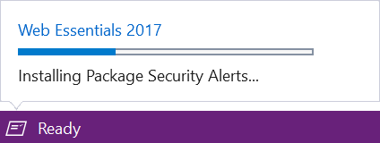
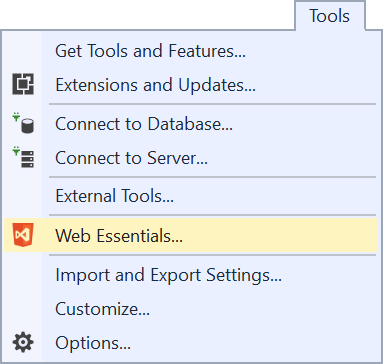
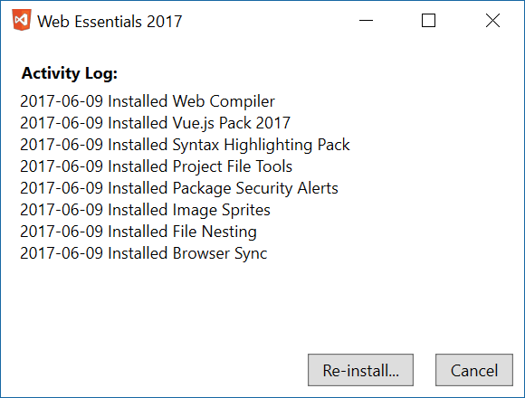

  # Web Essentials 2017

Download the extension at the
[VS Marketplace](https://marketplace.visualstudio.com/vsgallery/a5a27916-2099-4c5b-a3ff-6a46e4b01298)
or get the
[nightly build](http://vsixgallery.com/extension/bb7e2273-9a70-4e5e-b4dd-1f361b6166c0/)

------------------------------------

The easiest way to set up Visual Studio for the ultimate web development experience. Requires Visual Studio 2017 Update 3 or newer.

See the [change log](CHANGELOG.md) for changes and road map.

## Extensions
After installing the Web Essentials and restarting
Visual Studio, the following extensions will be installed:

- [Add New File](https://visualstudiogallery.msdn.microsoft.com/3f820e99-6c0d-41db-aa74-a18d9623b1f3)
- [Browser Reload on Save](https://visualstudiogallery.msdn.microsoft.com/46eef4d9-045b-4596-bd7f-eee980bb5450)
- [Browser Sync](https://visualstudiogallery.msdn.microsoft.com/5741a548-5179-4a77-ad96-fca71535774d)
- [Bundler & Minifier](https://visualstudiogallery.msdn.microsoft.com/9ec27da7-e24b-4d56-8064-fd7e88ac1c40)
- [CSS Tools](https://marketplace.visualstudio.com/items?itemName=MadsKristensen.CSSTools)
- [Editor Enhancements](https://visualstudiogallery.msdn.microsoft.com/4f64e542-3772-4136-8f87-0113441c7aa1)
- [File Icons](https://visualstudiogallery.msdn.microsoft.com/5e1762e8-a88b-417c-8467-6a65d771cc4e)
- [File Nesting](https://visualstudiogallery.msdn.microsoft.com/3ebde8fb-26d8-4374-a0eb-1e4e2665070c)
- [HTML Tools](https://marketplace.visualstudio.com/items?itemName=MadsKristensen.HtmlTools)
- [Image Sprites](https://visualstudiogallery.msdn.microsoft.com/8bb845e9-5717-4eae-aed3-1fdf6fe5819a)
- [Image Optimizer](https://visualstudiogallery.msdn.microsoft.com/a56eddd3-d79b-48ac-8c8f-2db06ade77c3)
- [Markdown Editor](https://visualstudiogallery.msdn.microsoft.com/eaab33c3-437b-4918-8354-872dfe5d1bfe)
- [Open Command Line](https://visualstudiogallery.msdn.microsoft.com/4e84e2cf-2d6b-472a-b1e2-b84932511379)
- [Package Installer](https://visualstudiogallery.msdn.microsoft.com/753b9720-1638-4f9a-ad8d-2c45a410fd74)
- [Package Security Alerts](https://marketplace.visualstudio.com/items?itemName=MadsKristensen.PackageSecurityAlerts)
- [Project File Tools](https://aka.ms/projfiletools)
- [Razor Language Service](https://aka.ms/razorlangsvc)
- [Syntax Highlighting Pack](https://visualstudiogallery.msdn.microsoft.com/d92fd742-bab3-4314-b866-50b871d679ee)
- [Vue.js Pack 2017](https://marketplace.visualstudio.com/items?itemName=MadsKristensen.VuejsPack-18329)
- [Web Accessibility Checker](https://visualstudiogallery.msdn.microsoft.com/3aabefab-1681-4fea-8f95-6a62e2f0f1ec)
- [Web Compiler](https://visualstudiogallery.msdn.microsoft.com/3b329021-cd7a-4a01-86fc-714c2d05bb6c)
- [ZenCoding](https://marketplace.visualstudio.com/items?itemName=MadsKristensen.ZenCoding)

If you already have one or more of these extensions installed,
Web Essentials will not re-install them. It will simply
just skip them.

### Honorable mentions
These extensions are not included, but they are likely to be of
interest.

- [.ignore](https://visualstudiogallery.msdn.microsoft.com/d0eba56d-603b-45ab-a680-edfda585f7f3)
- [NPM Task Runner](https://visualstudiogallery.msdn.microsoft.com/8f2f2cbc-4da5-43ba-9de2-c9d08ade4941)
- [Client-Side Library Installer](https://visualstudiogallery.msdn.microsoft.com/4cd5e0e0-2c38-426b-9f43-1d3688cc8be1)
- [Open in VS Code](https://visualstudiogallery.msdn.microsoft.com/33f6f3fd-68e8-4783-b934-ece91a08d265)
- [Text Generator](https://visualstudiogallery.msdn.microsoft.com/4d809607-87dd-445c-8cd4-585da67c6beb)
- [Trailing Whitespace Visualizer](https://visualstudiogallery.msdn.microsoft.com/a204e29b-1778-4dae-affd-209bea658a59)

## Installing
It doesn't take long to install the extensions. Probably less
than a minute. The progress is shown in the new Task Status Center in the left corner of the Status Bar.

When installation is done you will be prompted to restart
Visual Studio. After the restart, all the extensions are
fully functional and ready to use.

## Reset Web Essentials
If you've uninstalled any of the extensions installed by Web Essentials, then those extensions won't be installed again automatically.

To reset this behavior go to _Tools -> Web Essentials..._

This will show the Activity Log for Web Essentials.

From here you can reset the extension. This will attempt to install any of the extensions previously uninstall or for other reasons are not currently installed.

## Suggest new extensions
If you know of any good extensions that you think would benefit web
developers, then log an issue with the suggestion on the 
[GitHub issue tracker](https://github.com/madskristensen/WebExtensionPack/issues).

## Contribute
Check out the [contribution guidelines](.github/CONTRIBUTING.md)
if you want to contribute to this project.

For cloning and building this project yourself, make sure 
to install the
[Extensibility Tools 2015](https://visualstudiogallery.msdn.microsoft.com/ab39a092-1343-46e2-b0f1-6a3f91155aa6)
extension for Visual Studio which enables some features
used by this project.

## License
[Apache 2.0](LICENSE) 